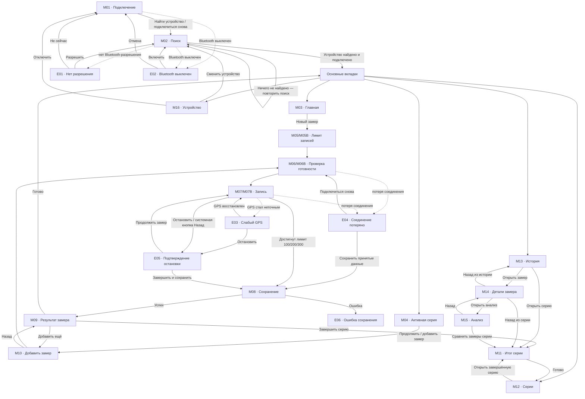
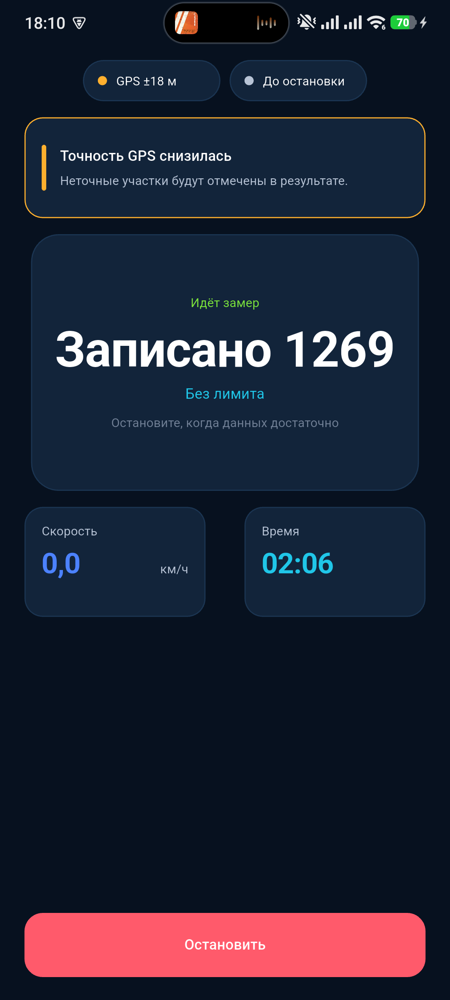
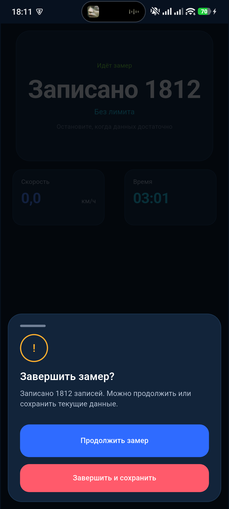
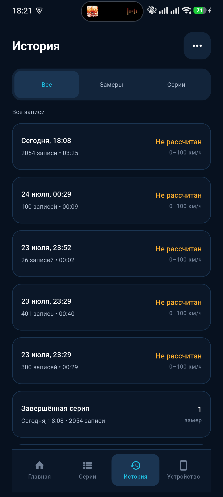
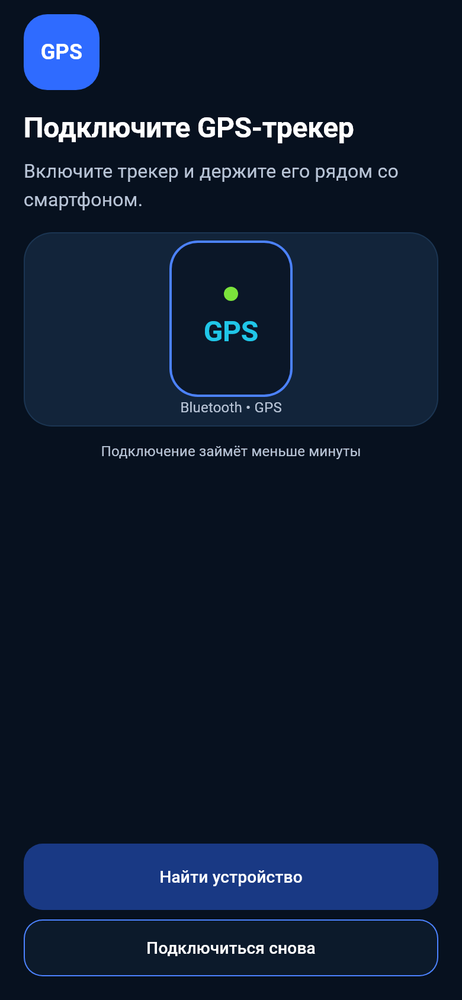
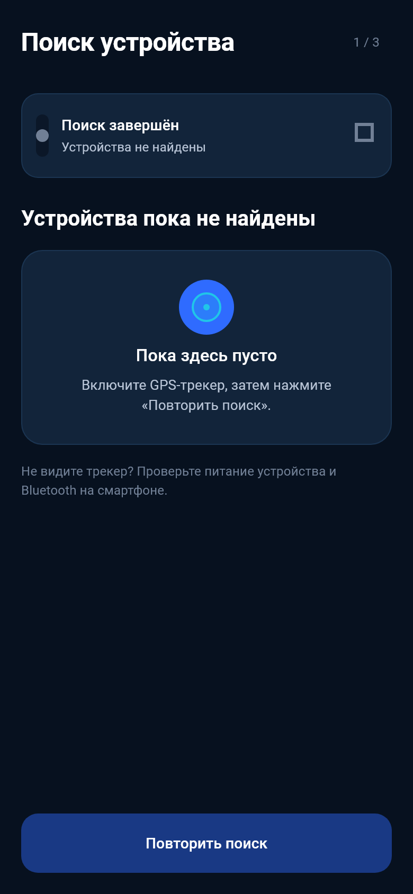
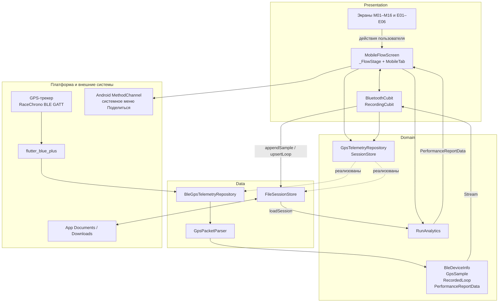

# LoopRunner

LoopRunner — мобильное Flutter-приложение для записи и анализа телеметрии с внешнего GPS-трекера по Bluetooth Low Energy. Приложение принимает GPS-пакеты, сохраняет точки замера, объединяет замеры в серии и рассчитывает показатели движения, включая дистанцию, максимальную скорость и разгон 0–100 км/ч.

> В интерфейсе `Записано N` означает количество полученных GPS-записей, а не скорость и не расстояние.

## Основной пользовательский сценарий

1. Пользователь включает внешний GPS-трекер и подключает его на экранах M01–M02.
2. На главном экране M03 создаёт новый замер или продолжает активную серию через M04.
3. Выбирает лимит: 100, 200, 300 записей либо ручную остановку на M05/M05B.
4. Проверяет подключение и качество GPS на M06/M06B, после чего запускает запись.
5. M07/M07B показывает количество записей, скорость, время и точность GPS в реальном времени.
6. При достижении фиксированного лимита запись завершается автоматически. В ручном режиме пользователь нажимает «Остановить» и подтверждает действие на E05.
7. M08 сохраняет данные, M09 показывает результат. Затем можно добавить ещё один замер в ту же серию на M10 либо завершить серию и открыть её итог M11.
8. Сохранённые серии и отдельные замеры доступны на M12–M15. Подключённый трекер можно посмотреть или сменить на M16.

## Навигация приложения

Активная навигация реализована внутри `MobileFlowScreen`: этап сценария хранится в `_FlowStage`, а основной раздел — в `MobileTab`. Именованные маршруты и `go_router` в текущем мобильном сценарии не используются.

### Нижняя навигация

После подключения доступны четыре вкладки:

| Вкладка | Экран | Назначение |
|---|---|---|
| Главная | M03 или M04 | Новый замер, продолжение активной серии и быстрый переход к последнему результату |
| Серии | M12 | Активная серия, завершённые серии и создание новой серии |
| История | M13 | Все замеры и серии с фильтрами |
| Устройство | M16 | Состояние Bluetooth, GPS и потока данных; смена или отключение трекера |

## Скриншоты приложения

### Физическое Android-устройство

Кадры сняты с актуальной debug-сборки `com.nameunique.looprunner` на физическом устройстве `23049PCD8G` 26 июля 2026 года. Во время проверки приложение получало настоящий BLE-поток от трекера и сохранило ручной замер из 2054 записей.

<table>
  <tr>
    <td width="33%">
      
    </td>
    <td width="33%">
      
    </td>
    <td width="33%">
      
    </td>
  </tr>
  <tr>
    <td><strong>M07B · Ручной замер</strong> Запись идёт без лимита. Показаны число GPS-записей, длительность, скорость и предупреждение о слабой точности.</td>
    <td><strong>E05 · Остановка</strong> Можно вернуться к записи либо завершить замер и сохранить уже полученные данные.</td>
    <td><strong>M13 · История</strong> Отдельные замеры и завершённые серии загружаются из локального хранилища.</td>
  </tr>
</table>

На тестовом трекере в этом запуске отсутствовал валидный спутниковый fix, поэтому в истории 0–100 км/ч помечено как «Не рассчитан». Сами 2054 строки телеметрии были сохранены в JSONL полностью.

### Детерминированные Flutter-рендеры

Эти изображения сгенерированы непосредственно из текущих Flutter-виджетов при размере экрана 390×844. Это не макеты из Figma: они показывают фактическую вёрстку стартовых состояний приложения без данных от реального устройства.

<table>
  <tr>
    <td width="50%">
      
    </td>
    <td width="50%">
      
    </td>
  </tr>
  <tr>
    <td><strong>M01 · Подключение</strong> Первый запуск, поиск нового трекера или попытка повторного соединения.</td>
    <td><strong>M02 · Устройства не найдены</strong> Поиск завершён без результатов; пользователь может включить трекер и повторить сканирование.</td>
  </tr>
</table>

## Что происходит на каждом экране

Номера M01–M16 и E01–E06 соответствуют именам экранов в `lib/features/mobile/presentation/`.

### Подключение

| Код | Экран и условия | Что происходит | Основные переходы |
|---|---|---|---|
| M01 | Подключение GPS-трекера | Показывает инструкцию перед первым подключением. «Подключиться снова» использует ID последнего устройства, запомненный в оперативной памяти текущего запуска. | «Найти устройство» → M02. Повторное подключение → основной интерфейс; при неудаче остаётся M01/M02. |
| M02 | Поиск устройства | Запрашивает разрешения, запускает BLE-сканирование на 15 секунд и показывает пустое состояние либо список найденных трекеров. При нескольких устройствах каждое имеет отдельную кнопку подключения; список сортируется по уровню сигнала. | «Подключить» → M03/M04. При смене устройства → обратно M16. «Остановить поиск»/Назад → M01. «Повторить поиск» → новый цикл M02. |
| E01 | Нет разрешения Bluetooth | Объясняет, зачем приложению Bluetooth-доступ. | «Разрешить» повторяет запрос и поиск. «Не сейчас» → M01. |
| E02 | Bluetooth выключен | Просит включить Bluetooth до начала поиска или замера. | «Включить Bluetooth» → M02. Отмена → M01 либо основной экран, если замер ещё не начат. |

### Главная, подготовка и запись

| Код | Экран и условия | Что происходит | Основные переходы |
|---|---|---|---|
| M03 | Главная без активной серии | Показывает состояние трекера/GPS, кнопку нового замера и последний сохранённый результат. | «Новый замер» → M05. Последний результат → M14. Карточка трекера → M16. |
| M04 | Главная с активной серией | Показывает дату серии, количество замеров и предыдущий лимит. | «Продолжить»/«Добавить замер» → M10. |
| M05 | Выбор фиксированного лимита | Пользователь выбирает 100, 200 или 300 GPS-записей. При продолжении создаётся новый черновик либо используется уже созданный черновик серии. | «Продолжить» → M06/M06B. Назад удаляет ещё не использованный черновик. |
| M05B | Ручной лимит | Выбран режим «Пока не остановлю». Автоматического завершения по количеству записей не будет. | «Продолжить» → M06/M06B. |
| M06 | Проверка готовности | Трекер подключён, GPS-пакет свежий и точность достаточна. Показывает устройство, GPS, точность и выбранный лимит. | «Начать замер» → M07/M07B. Изменение лимита/Назад → M05 или M10. |
| M06B | Слабый GPS перед стартом | GPS-пакеты поступают, но fix или точность недостаточны. Кнопка «Начать замер» остаётся доступной; неточные участки будут отмечены в результате. | «Начать замер» → M07/M07B или E03. «Проверить снова» обновляет состояние. |
| M07 | Запись с лимитом | В реальном времени показывает количество записей, текущую скорость, время, дистанцию и точность. При достижении 100/200/300 записей завершает замер автоматически. | Лимит достигнут → M08. «Остановить»/Назад → E05. |
| M07B | Ручная запись | Те же показатели, но запись продолжается до явной остановки пользователя. | «Остановить»/Назад → E05. |
| E03 | GPS стал неточным во время записи | Запись не прерывается. Интерфейс предупреждает, что проблемные точки будут отмечены при анализе. | Восстановление GPS → M07/M07B. «Остановить» → E05. |
| E04 | Потеряно соединение | Активная запись ставится на паузу, уже принятые точки остаются в памяти и файле. | «Подключиться снова» → проверка готовности или продолжение записи. Можно отменить пустой черновик либо сохранить уже полученные данные. |
| E05 | Досрочная/ручная остановка | Показывает фактическое число записей и не завершает замер без подтверждения. | «Продолжить замер» → M07/M07B/E03. «Завершить и сохранить» → M08. |

Готовность GPS считается достаточной, если последний пакет не старше пяти секунд, `fixType >= 3`, найдено не менее четырёх спутников и `0 < HDOP <= 30`.

### Сохранение и результат

| Код | Экран и условия | Что происходит | Основные переходы |
|---|---|---|---|
| M08 | Сохранение | Блокирующее состояние: завершает сессию, записывает метаданные замера и готовит аналитику. Системная кнопка Назад игнорируется, чтобы не прервать операцию. | Успех → M09. Ошибка → E06. |
| E06 | Ошибка сохранения | Данные замера остаются в памяти. Повторная попытка снова сохраняет метаданные; безопасный возврат открывает доступный результат. | Повторить → M09 после успешной записи. Возврат → M09 с данными из памяти. |
| M09 | Результат замера | Показывает длительность, дистанцию, максимальную скорость, количество записей, 0–100 км/ч и лучший результат, если данные валидны. | «Добавить ещё» → M10. «Завершить серию» → M11. «Готово»/Назад → основная вкладка. |
| M10 | Добавить замер | Показывает текущую серию и позволяет выбрать новый лимит для следующего замера. | «Продолжить» → M06/M06B в той же серии. Назад → M09; неиспользованный черновик удаляется. |

### Серии, история и устройство

| Код | Экран и условия | Что происходит | Основные переходы |
|---|---|---|---|
| M11 | Итог серии | Показывает суммарные показатели, лучший результат и список замеров. Список можно сортировать по результату; серия экспортируется в JSONL. | Строка замера → M14. «Готово» → M12. |
| M12 | Серии | Показывает активную серию, последние завершённые серии или пустое состояние. | Активная серия → M10. Завершённая → M11. «Новая серия» завершает старую и открывает M05. «Все записи» → M13. |
| M13 | История | Фильтры «Все», «Замеры», «Серии». Данные загружаются из локального индекса. | Замер → M14. Серия → M11. CTA пустого состояния → M05. |
| M14 | Детали замера | Показывает метрики, график скорости и расчёт 0–100 км/ч. Меню позволяет экспортировать JSONL или добавить замер в серию. | «Открыть анализ» → M15. Назад возвращает в историю или итог серии. |
| M15 | Анализ | Подробный график, старт/финиш, ускорение и крупный результат 0–100. Невалидный GPS отображается как «Не рассчитан». | Назад → M14. «Сравнить» → M11, если замер входит в серию. «Поделиться» → системное меню Android или буфер обмена. |
| M16 | Устройство | Имя, уровень сигнала, время синхронизации, состояния Bluetooth/GPS и потока телеметрии. | «Сменить устройство» отключает текущий трекер и открывает M02; успешное подключение возвращает на M16. «Отключить» → M01. |

### Системная кнопка «Назад» и пограничные случаи

- На основной вкладке сначала выполняется возврат на «Главную».
- На M05 отменяется пустой черновик; на M06 выполняется возврат к выбору лимита.
- На M07/M07B кнопка Назад открывает E05, поэтому активная запись не теряется случайно.
- На M08 кнопка Назад отключена до завершения сохранения.
- M11 и M14 возвращаются в тот контекст, откуда были открыты: история, серии или результат.
- Смена устройства заблокирована во время активной записи и сопровождается сообщением.
- ID последнего трекера хранится только до перезапуска приложения; постоянного автоподключения между запусками пока нет.

## Данные и аналитика

BLE-трекер присылает 20-байтовые пакеты RaceChrono MAIN. Парсер преобразует их в `GpsSample`: время, скорость, координаты, высоту, курс, HDOP, тип fix и количество спутников.

Каждый замер хранится в отдельном JSONL-файле, где одна строка соответствует одной GPS-записи. Метаданные всех замеров и серий находятся в `loops_index.json`. Экспорт копирует выбранный JSONL в системную папку Downloads.

Аналитика рассчитывает:

- длительность и дистанцию;
- максимальную скорость;
- время 0–100 км/ч и промежуточные отсечки;
- ускорение, изменение высоты и уклон;
- валидность результата.

Результат считается валидным, когда не менее 70% точек имеют `fixType >= 3` и минимум четыре спутника. Расчёт разгона начинается только при стартовой скорости не выше 1 км/ч.

## Архитектура

Приложение использует упрощённую слоистую архитектуру:

| Слой | Ответственность | Основные файлы |
|---|---|---|
| Composition root | Инициализация Flutter, тема, DI и создание Cubit | `lib/main.dart`, `lib/app.dart`, `lib/core/di/` |
| Presentation | Экраны M01–M16/E01–E06, машина состояний сценария и общие мобильные компоненты | `lib/features/mobile/`, `lib/shared/` |
| State management | Разрешения, BLE-состояние, запись, лимиты и серии | `BluetoothCubit`, `RecordingCubit` |
| Domain | Сущности, контракты хранилища/телеметрии и независимая аналитика | `lib/domain/` |
| Data | BLE GATT, бинарный парсер и файловое JSONL-хранилище | `lib/data/` |
| Platform | Android share sheet, разрешения, Downloads и системные настройки | `lib/core/platform/`, плагины Flutter, Android host |

### Поток данных

1. `flutter_blue_plus` получает BLE notify от трекера.
2. `BleGpsTelemetryRepository` передаёт 20 байт в `GpsPacketParser`.
3. Парсер публикует `GpsSample` в broadcast stream.
4. `MobileFlowScreen` использует поток для статуса GPS, а `RecordingCubit` — для активного замера.
5. `FileSessionStore` дописывает каждую точку в JSONL и обновляет `loops_index.json`.
6. `RunAnalytics` загружает сохранённую сессию и создаёт `PerformanceReportData`.
7. Presentation показывает метрики, график и итог серии.

В исходниках также остаются отдельные legacy-экраны `LiveSensorsScreen`, `RecordingScreen` и `PerformanceReportScreen`. Они не входят в активную навигацию `MaterialApp(home: MobileFlowScreen(...))`.

## Основные библиотеки

| Библиотека | В `pubspec.yaml` | В `pubspec.lock` | Использование |
|---|---:|---:|---|
| `flutter_bloc` | `^9.1.1` | `9.1.1` | `BluetoothCubit` и `RecordingCubit` |
| `get_it` | `^8.1.0` | `8.3.0` | Dependency injection / service locator |
| `flutter_blue_plus` | `^1.35.5` | `1.36.8` | BLE-сканирование, подключение, GATT и notify |
| `permission_handler` | `^12.0.0` | `12.0.1` | Bluetooth, location и storage permissions |
| `path_provider` | `^2.1.5` | `2.1.5` | Каталог документов приложения |
| `downloadsfolder` | `^1.1.0` | `1.2.0` | Экспорт JSONL в Downloads |
| `equatable` | `^2.0.7` | `2.0.8` | Сравнение immutable-состояний и сущностей |
| `logger` | `^2.6.1` | `2.7.0` | Диагностические BLE-логи |
| `fl_chart` | `^0.70.2` | `0.70.2` | График в оставшемся legacy `PerformanceReportScreen` |

Активные графики M14/M15 рисуются собственным `MobileSpeedChart` на `CustomPainter`; `fl_chart` в новом мобильном сценарии не используется.