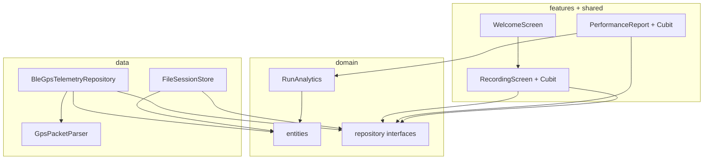

# Архитектура GPS Tracker Analyzer

Коротко: приложение делит работу на **два направления** — **бэкенд внутри приложения** (Bluetooth + файлы) и **фронтенд** (экраны и расчёты для графиков). Между ними стоят **абстракции** (интерфейсы репозиториев), чтобы UI не знал про `flutter_blue_plus` и пути к файлам.

---

## Зачем так сделано

| Слой | Отвечает за |
|------|-------------|
| **Domain** | Что такое «точка GPS», «отчёт», **контракты** «откуда брать данные» и «куда писать сессию» — без Flutter и BLE. |
| **Data** | Реальные вещи: сканирование BLE, разбор 20 байт пакета, запись строк в JSONL-файл. |
| **Features (UI)** | Экраны и **Cubit** — когда нажать «скан», «запись», как показать отчёт. |
| **Core** | Общее: цвета, разрешения, **GetIt**, UUID сервиса в `ble_gatt_config.dart`. |

Так проще **подменять** реализацию (например, вместо BLE — чтение из файла для тестов) и **переиспользовать** домен и аналитику без привязки к экранам.

---

## Поток данных (главная идея)

```
[Устройство BLE]
       │ notify (20 байт)
       ▼
┌──────────────────────────┐
│  BleGpsTelemetryRepository │  ← data/ble/
│  + GpsPacketParser         │
└────────────┬─────────────┘
             │ Stream<GpsSample>
             ▼
┌──────────────────────────┐     ┌─────────────────┐
│   RecordingCubit          │────▶│  SessionStore    │  JSONL на диск
│   (запись прогона)        │     │  FileSessionStore│
└──────────────────────────┘     └────────┬──────────┘
                                          │ loadSession(path)
                                          ▼
                                 ┌─────────────────┐
                                 │  RunAnalytics   │  дистанция, 0–100, g, уклон…
                                 └────────┬────────┘
                                          ▼
                                 ┌─────────────────┐
                                 │ PerformanceReport│
                                 │ Cubit + Screen   │
                                 └─────────────────┘
```

1. **Подключились** к устройству → репозиторий подписывается на характеристику и шлёт в поток уже разобранные `GpsSample`.
2. **Начали запись** → Cubit для каждого сэмпла вызывает `SessionStore.appendSample` → строки попадают в файл.
3. **Остановили запись** → по пути к файлу открывается отчёт: загрузка сэмплов → `RunAnalytics.compute` → экран с графиком и таблицей интервалов.

---

## Структура папок `lib/`

```
lib/
├── main.dart                 # ensureInitialized, configureDependencies(), runApp
├── app.dart                  # MaterialApp, маршруты, тема
│
├── core/
│   ├── config/               # BLE UUID, правила «Valid»
│   ├── di/injection.dart     # GetIt: репозитории, Logger, парсер, аналитика
│   ├── permissions/          # запрос Bluetooth / локации на Android
│   └── theme/                # цвета под макет отчёта
│
├── domain/                   # «чистая» логика и контракты
│   ├── entities/             # GpsSample, отчёт, BleDeviceInfo
│   ├── repositories/       # интерфейсы GpsTelemetryRepository, SessionStore
│   └── services/
│       └── run_analytics.dart
│
├── data/                     # реализации под платформу
│   ├── ble/
│   │   ├── ble_gps_telemetry_repository.dart
│   │   └── gps_packet_parser.dart
│   └── session/
│       └── file_session_store.dart
│
├── features/                 # экраны + Cubit по фичам
│   ├── welcome/
│   ├── recording/
│   └── performance_report/
│
└── shared/widgets/           # MetricTile, IntervalGrid, ValidStamp…
```

---

## Зависимости между слоями

- **Domain** не импортирует `flutter`, `flutter_blue_plus`, `path_provider`.
- **Data** зависит от **domain** (реализует интерфейсы, возвращает entity).
- **Features** зависят от **domain** и берут реализации через **GetIt** (`sl<...>()` в `injection.dart`).



---

## Состояние UI: flutter_bloc (Cubit)

- **RecordingCubit** — разрешения, скан, `connect`/`disconnect`, старт/стоп записи в файл, счётчик точек.
- **PerformanceReportCubit** — загрузка файла сессии, вызов `RunAnalytics`, состояние «грузится / готово / ошибка».

Cubit **не** содержит низкоуровневого BLE-кода — только вызовы `GpsTelemetryRepository` и `SessionStore`.

---

## Внедрение зависимостей (GetIt)

Файл `lib/core/di/injection.dart` регистрирует синглтоны:

- `GpsTelemetryRepository` → `BleGpsTelemetryRepository`
- `SessionStore` → `FileSessionStore`
- плюс `GpsPacketParser`, `RunAnalytics`, `Logger`

Экраны создают Cubit и передают туда `sl<GpsTelemetryRepository>()` и т.д.

---

## Конфигурация BLE

`lib/core/config/ble_gatt_config.dart` — UUID сервиса и характеристик (RaceChrono DIY: сервис `0x1FF8`, GPS main `0x0003`, time `0x0004`). При смене устройства или прошивки правится **только этот файл** (и при необходимости парсер под формат пакета).

---

## Маршруты

| Маршрут | Экран |
|---------|--------|
| `/` | Приветствие → «Начать работу» |
| `/recording` | Скан, список устройств, запись, переход к отчёту |
| `/report` | Аргумент: путь к `.jsonl` сессии |

Описано в `lib/app.dart`.

---

## Где что менять

| Задача | Где смотреть |
|--------|----------------|
| Другой формат BLE-пакета | `data/ble/gps_packet_parser.dart`, при необходимости поля в `domain/entities/gps_sample.dart` |
| Другая логика отчёта / метрик | `domain/services/run_analytics.dart`, `validation_config.dart` |
| Новый экран в том же стиле | `features/…`, общие виджеты в `shared/widgets/` |
| Другой способ хранения сессий | новый класс, реализующий `SessionStore`, регистрация в `injection.dart` |

---

## Стек (напоминание)

- **flutter_bloc** — состояние экранов.
- **get_it** — DI без привязки к `BuildContext`.
- **flutter_blue_plus** — BLE (только в `data/ble/`).
- **path_provider** + файлы — сессии в каталоге документов приложения.
- **fl_chart** — график в отчёте (только UI отчёта).

Если нужно углубиться в один слой — начни с `domain/repositories/` (контракты), затем открой соответствующий файл в `data/`.
